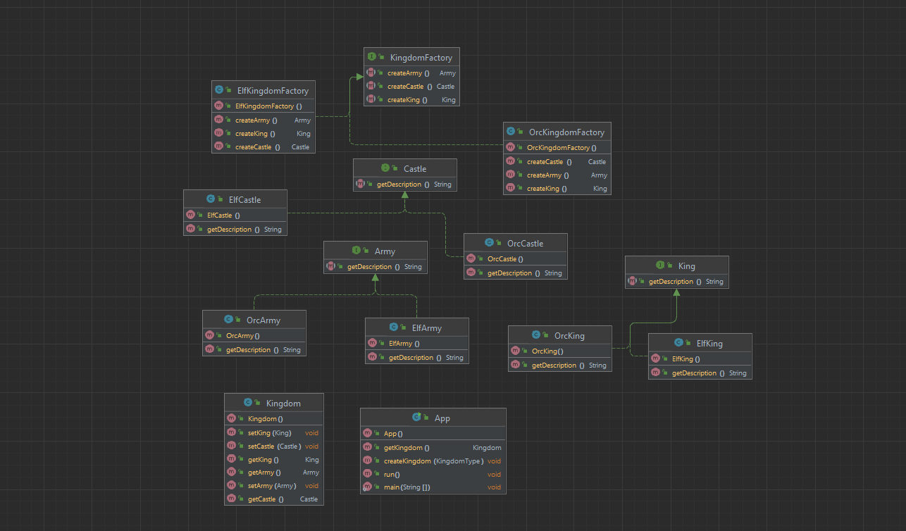

# Abstract Factory Pattern

Bir biriga aloqador yoki bog'liq objectlarni aniq classlarini ko'rsatmasdan yaratish uchun interface yoki abstract classni
taqdim etadigan pattern. Abstract Factoryni Factorylarni Factorisi deb ham atashadi.

## Example


### Class Diagram



## Explanation

Tushuntirish

Shohlikni yaratish uchun bizga umumiy mavzuga ega objectlar kerak.
Elf qirolligiga elf qiroli, elf qal'asi va elf armiyasi kerak, ork qirolligiga esa ork qiroli, ork qal'asi va
ork armiyasi kerak. Shohlikdagi objectlar o'rtasida bog'liqlik mavjud.

Mavhum zavod namunasi umumiy mavzuga ega bo'lgan alohida zavodlar
guruhini ularning aniq sinflarini ko'rsatmasdan qamrab olish usulini taqdim etadi.

## Example

```java
public interface Castle {
    String getDescription();
}

public interface King {
    String getDescription();
}

public interface Army {
    String getDescription();
}

// Elf implementations ->
public class ElfCastle implements Castle {
    static final String DESCRIPTION = "This is the elf castle!";

    @Override
    public String getDescription() {
        return DESCRIPTION;
    }
}

public class ElfKing implements King {
    static final String DESCRIPTION = "This is the elf king!";

    @Override
    public String getDescription() {
        return DESCRIPTION;
    }
}

public class ElfArmy implements Army {
    static final String DESCRIPTION = "This is the elf Army!";

    @Override
    public String getDescription() {
        return DESCRIPTION;
    }
}

// Orc implementations similarly -> ...
```

```java
public interface KingdomFactory {
    Castle createCastle();

    King createKing();

    Army createArmy();
}

public class ElfKingdomFactory implements KingdomFactory {

    @Override
    public Castle createCastle() {
        return new ElfCastle();
    }

    @Override
    public King createKing() {
        return new ElfKing();
    }

    @Override
    public Army createArmy() {
        return new ElfArmy();
    }
}

public class OrcKingdomFactory implements KingdomFactory {

    @Override
    public Castle createCastle() {
        return new OrcCastle();
    }

    @Override
    public King createKing() {
        return new OrcKing();
    }

    @Override
    public Army createArmy() {
        return new OrcArmy();
    }
}
```


