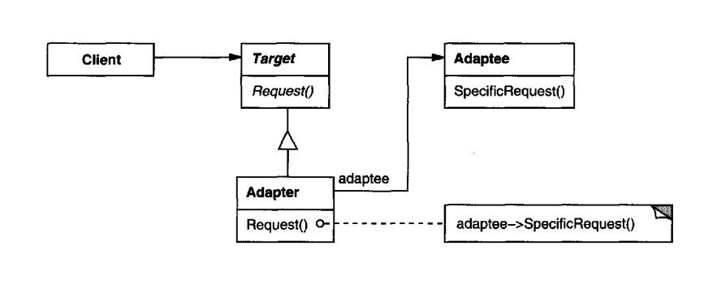

# Adapter

Adapter Design Pattern 2ta bir biriga mos kelmaydigan interfacelar o'rtasida ulagich vazfasini bajaradi. 



# Usage Examples

* `java.util.Arrays#asList()`
* `jav.util.Collections#list()`

# Computer World Example

```java
public class ReactiveJwtAuthenticationConverterAdapter implements Converter<Jwt, Mono<AbstractAuthenticationToken>> {
    private final Converter<Jwt, AbstractAuthenticationToken> delegate;

    public ReactiveJwtAuthenticationConverterAdapter(Converter<Jwt, AbstractAuthenticationToken> delegate) {
        Assert.notNull(delegate, "delegate cannot be null");
        this.delegate = delegate;
    }

    public final Mono<AbstractAuthenticationToken> convert(Jwt jwt) {
        Mono var10000 = Mono.just(jwt);
        Converter var10001 = this.delegate;
        Objects.requireNonNull(var10001);
        return var10000.map(var10001::convert);
    }
}

// ...

public class SecurityConfiguration {

    @Bean
    public Converter<Jwt, Mono<AbstractAuthenticationToken>> jwtAuthenticationConverter() {
        JwtAuthenticationConverter authenticationConverter = new JwtAuthenticationConverter();
        authenticationConverter.setJwtGrantedAuthoritiesConverter(new JwtGrantedAuthorityConverter());
        return new ReactiveJwtAuthenticationConverterAdapter(authenticationConverter);
    }

}    
```
