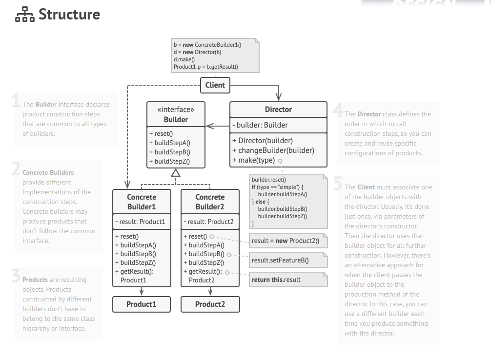
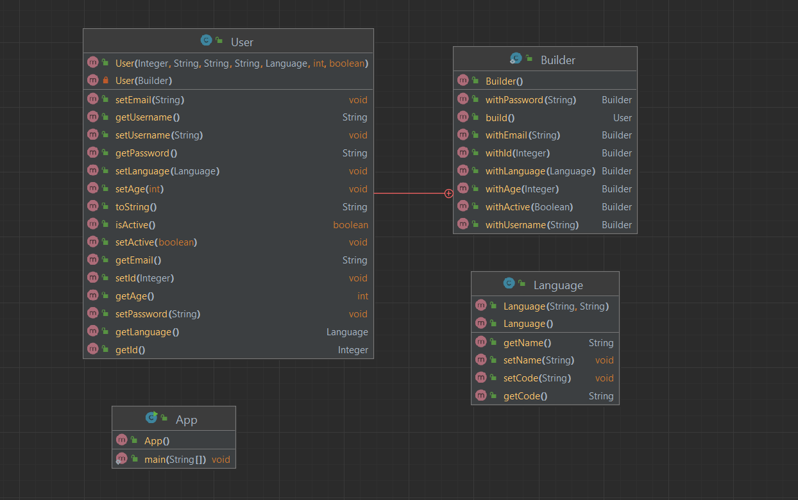

# Builder 

Builder pattern aims to “Separate the construction of a complex object from its representation 
so that the same construction process can create different representations.” It is used to construct a 
complex object step by step and the final step will return the object. The process of constructing an object 
should be generic so that it can be used to create different representations of the same object.

---

Builder - bu murakkab objectlarni bosqichma bosqich qurish imkonini beruvchi creational design pattern. Pattern bir xil
konstruksiya kodi yordamida objectning turli turlari va tasvirlarini yaratish imkonini beradi. Qisqa qilib aytganda
Builder Dizayn pattern murakkab objectlarni bosqichma bosqich qurish uchun ishlatiladi.

Builder sizga objectni qurish kodini o'z classidan chiqarib tashlashni va uni `Builders` deb nomlangan alohida objectlarga
ko'chirishni taklif qiladi. Builder object qurish jarayonini bosqichlarga ajratadi. Objectni yaratish uchun siz builder
objectda qadamlar qatorini bajarasiz. Muhimi shundaki, siz barcha bosqichlarni chaqirishingiz shart emas. 

## Structure

## Class Diagram

- Product – The product class defines the type of the complex object that is to be generated by the builder pattern.
- Builder – This abstract base class defines all of the steps that must be taken in order to correctly create a product. Each step is generally abstract as the actual functionality of the builder is carried out in the concrete subclasses. The GetProduct method is used to return the final product. The builder class is often replaced with a simple interface.
- ConcreteBuilder – There may be any number of concrete builder classes inheriting from Builder. These classes contain the functionality to create a particular complex product.
- Director – The director-class controls the algorithm that generates the final product object. A director object is instantiated and its Construct method is called. The method includes a parameter to capture the specific concrete builder object that is to be used to generate the product. The director then calls methods of the concrete builder in the correct order to generate the product object. On completion of the process, the GetProduct method of the builder object can be used to return the product.

## Applicability

- 'Teleskop constructor' dan xolos bo'lish uchun Builder patternidan foydalaning.

Builder sizga kerakli qadamlardan foydalangan holda ob'ektlarni bosqichma-bosqich qurish imkonini beradi. 
Pattern amalga oshirgandan so'ng, endi konstruktorlaringizga o'nlab parametrlarni kiritishingiz shart emas.

- Composite trees yoki boshqa murakkab objectlarni qurish uchun Builder foydalaning.

