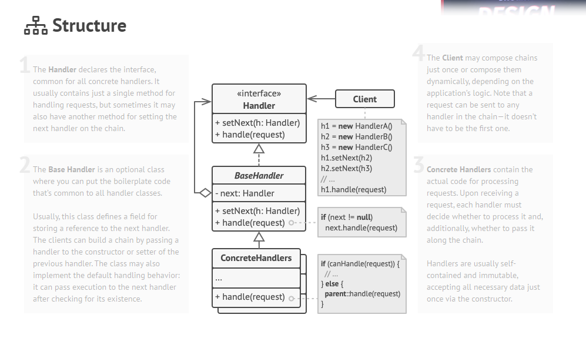

# Chain of Responsibility

Chain of Responsibility patterni bu requestlarni ishlovchilar yani handlerlar zanjiri bo'ylab uzatish imkonini beruvchi
behavioral design patterni. Requestni qabul qilgandan so'ng, har bir handler requestni qayta ishlashga yoki uni 
zanjirdagi keyingi ishlov beruvchiga o'tkazishga qaror qiladi. Ushbu design pattern asosiy maqsadi rasshiraymisni
tanaminlash yani siz dasturdagi hech qaysi class o'zgartirmasdan kod qo'shish imkoni beradi. Ushbu Pattern yaxshi tomoni
siz o'zingiz hohlagancha handlerlarni o'zingizga moslab olishingiz mumkin.

Ushbu Dizayn Patternda siz objectlar zanjirini shakllantirasiz. Siz ushbu ishlov beruvchilarni xohlagan tartibda 
joylashtirishingiz mumkin. Qayta ishlash zanjiri ikki xolatda tugashi mumkin.

- Handler requestni to'liq qayta ishlashi mumkin. 
- Yoki siz zanjirni oxiriga yetib bordingiz.

## Real World Example

Aksariyat tashkilotlarida mijozlarning fikr mulohazalarini oladigan va har qanday muammolarni tashkilotning tegishli
bo'limlariga yuboradigan bo'limlar mavjud. Biroq, bu bo'limlarning hammasi ham bir vaqtning o'zida muammoni hal qila
olmaydi. Ma'sul bo'lgan birinchi bo'lim masalani ko'rib chiqadi va agar o'sha xodimlar masalani boshqa bo'limga 
yuborish kerak deb hisoblasa, ularni uni yo'naltiradilar.

## Structure

1. Birinchi navbatda barcha concrete handler lar uchun umumiy bo'lgan `Handler` interfaceni e'lon qilishimiz kerak.
2. `BaseHandler` bu `Handler` interfacelarni implementatsiyalari o'rtasidagi class bo'lib. unda siz barcha handlerlar
uchun umumiy bo'lgan kodini yozishingiz mumkin. 
3. Concrete Handler lar requestlarni qayta ishlash uchun haqiqiy kodni o'z ichiga oladi. requestni olgandan so'ng, har
bir handler uni qayta ishlash va qo'shimcha ravishda uni zanjir bo'ylab o'tkazish to'g'risida qaror qabul qilishi kerak.

Handler lar odat mustaqil va o'zgarmas bo'lib, barcha kerakli ma'lumotlarni consrtuctor orqali bir marta qabul qiladi.

## Applicability

- Agar dasturingiz har xil turdagi requestlarni turli yo'llar bilan qayta ishlashni kutsa, lekin requestlarning aniq turlari
va ularning ketma ketligi oldindan noma'lum bo'lsa, Chain of Responsibility Patternidan foydalaning.

- Handler to'plami va ularning tartibi ish vaqtida o'zgartirish kerak bo'lganda CoR Patternidan foydalaning