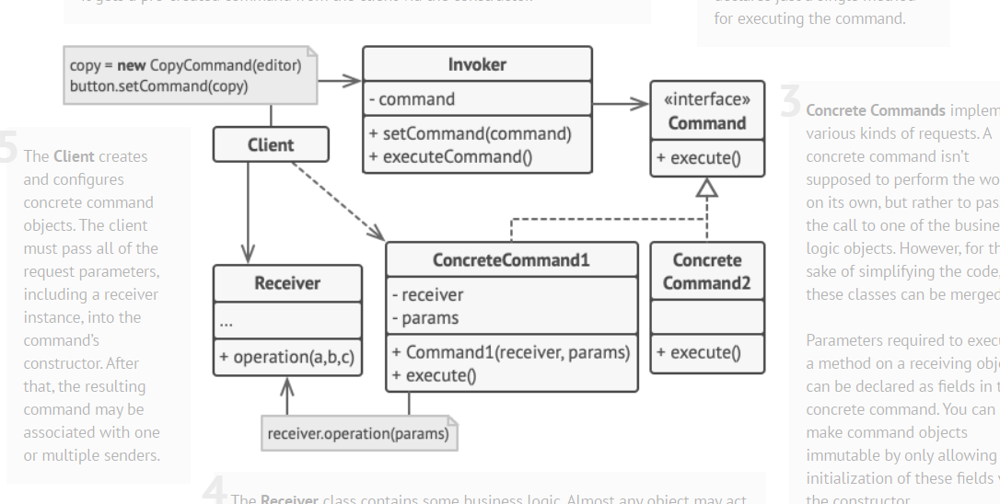

# Command

Command Design Pattern - bu bizga jo'natuvchi va qabul qiluvchi o'rtasida to'liq ajratishga erishish imkonini beruvchi
Behavioral Pattern namunasidir. Command Design Patternning namunasi so'rivni qachon va qanday bajarilishini o'zgartirishga
imkon beradi. Command bizni moslashuvchanlik bilan bir qatorda kengaytirishini ham ta'minlaydi.

Command design patternidan foydalanib method chaqiruvini qamrab olasiz. Bu so'rovni so'rov haqidagi barcha ma'lumotlarni
o'z ichiga olgan mustaqil objectga aylantiruvchi behavioral pattern. Bu o'zgartirish so'rovlarini method argumentlari
sifatida topshirish, so'rov bajarilishini kechiktirish yoki navbatga qo'yish hamda qaytarib bo'lmaydigan operatsiyalarni 
qo'llab quvvatlash imkonini beradi.

# Structure

Command Patternni amalga oshirish uchun to'rtta component kerak bo'ladi. Command, Receiver, Invoker va Client

