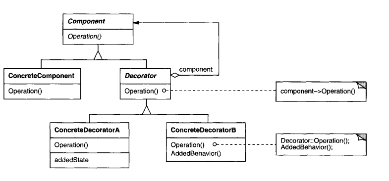

# Decorator

Decorator - bu objectlarni decorator deb ataladigan maxsus wrapper objectlari ichiga joylashtirish orqali ularga dinamik
ravishda yangi xatti-harakatlar qo'shish imkonini beruvchi structural pattern. 

# Structural Design Pattern

Strukturaviy Design Patternlar objectlar o'rtasidagi munosabatlar bilan bog'liq. Murakkab class ierarxiyasini yaratmasdan
objectlarimizning funksionalligini kengaytirish uchun ishlatiladi.

# Participants

- **Component**
  - defines the interface for objects that can have responsibilities added to them dynamically.
- **ConcreteComponent**
  - defines an object towhich additional responsibilities canbe attached.
- **Decorator**
  - maintains a reference to a Component object and defines an interface that conforms to Component's interface.
- **ConcreteDecorator**
  - adds responsibilities to the component.

# Consequences

Decorator Design pattern kamida 2ta asosiy afzallik va 2ta majburiyatga ega.

1. Static inheritance ga qaraganda moslashuvchanroq. Decorator namunasi static (bir nechta) inheritance ga qaraganda
objectlarga mas'uliyat qo'shishning yanada moslashuvchan usulini ta'minlaydi. Decoratorlar yordamida ma'suliyatni 
ularni ulash va ajratish orqali runtime da qo'shish va olib tashlash imkoni beradi. Aksincha, Inheritence har bir
qo'shimcha javobgarlik uchun yangi class yaratishni talab qiladi. Bu esa ko'plab classlarni keltirib chiqaradi va 
tizimning murakkabligini oshiradi.  
