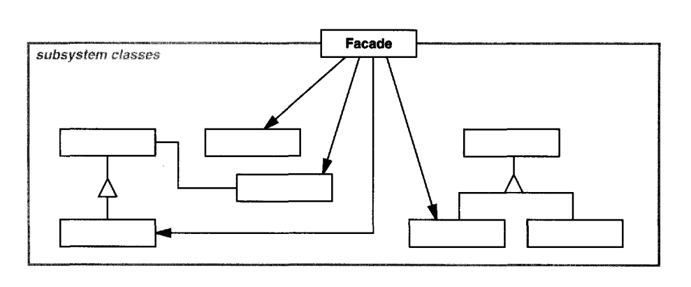

# Facade

Facade - bu juda ko'p harakatlanuvchi qismlarni o'z ichiga olgan murakkab quyi tizimga oddiy interface ta'minlovchi
class.

Quyi tizimdagi interfacelar to'plamiga birlashtirilgan interfaceni taqdim eting. Facade quyi tizimdan foydalanishni
osonlashtiradigan yuqori darajadagi interfaceni belgilaydi. 

Tizimning quyi tizimlarga tuzilishi murakkablikni kamaytirishga yordam beradi. Dizaynning umumiy maqsadi quyi tizimlar
orasidagi aloqa va bog'liqlikni minimallashtirishdir. Ushbu maqsadga erishish yo'llaridan bir quyi tizimning umumiy
imkoniyatlariga yagona, soddalashtirilgan interfaceni ta'minlaydigan facade objectni e'lon qilishdir.

Facade ga yaqol misol bu cartdan cartga pul o'tkazish facade siz pul o'tkazishingiz uchun bitta method beradi ammo
ichkarida esa siz bilmagan ko'p harakatlarni amalga oshiradi.

---

Provide a unified interface to a set of interfaces in a subsystem. Facade defines a
higher-level interface that makes the subsystem easier to use.

Structuring a system into subsystems helps reduce complexity.A common design
goal is to minimize the communication and dependencies between subsystems.
One way to achieve this goal is to introduce a facade object that provides a single,
simplified interface to the more general facilities of a subsystem.

## Structure

1. Facade quyi tizim funksiyalarining ma'lum bir qismiga qulay kirishni ta'minlaydi. U mijozning so'rovini qayerga 
yo'naltirishni va barcha harakatlanuvchi qismlarni qanday ishlashni biladi.

Facade Design Pattern qisa qilib aytganda, facade oddiy interface orqasida murakkab quyi tizimni qamrab oladi. Bu
murakkablikning katta qismini yashiradi va quyi tizimdan foydalanishni osonlashtiradi. 

