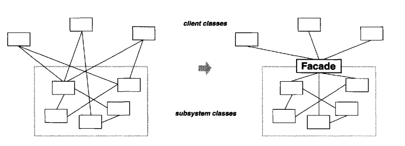

# Facade

## GoF Definition

Quyi tizimdagi interfacelar to'plamiga yagona interfaceni taqdim etadi. Facade namunasi quyi tizimdan foydalanishni 
osonlashtiradigan yuqori darajadagi interfaceni belgilaydi.

---

It provides a unified interface to a set of interfaces in a subsystem. The Facade pattern
defines a higher-level interface that makes the subsystem easier to use.

## Computer World Example

librarydagi method foydalanganda (dasturlash tili conteksida) vaziyat haqida o'ylab ko'ring. Method kutubxonada qanday
amalga oshirilganligi haqida tashvishlanmaysiz. Siz shunchaki methodni ishlatish uchun chaqirasiz.

## Concept

Tizimning quyi tizimlarga tuzilishi murakkablikni kamaytirishga yordam beradi. Dizaynning umumiy maqsadi quyi tizimlar
orasidagi aloqa va bog'liqlikni minimallashtirishdir. Ushbu maqsadga erishish yo'llaridan bir quyi tizimning umumiy
imkoniyatlariga yagona, soddalashtirilgan interfaceni ta'minlaydigan facade objectni e'lon qilishdir.

Facadega oddiy misol. Aytaylik, ilova bir nechta classlarga ega va ularning har biri bir nechta methodlardan iborat.
Mijoz ushbu classlardagi methodlarning kombinatsiyasidan foydalangan holda mahsulotni yaratishi mumkin, ammo ular qaysi
classlarni tanlashni va ushbu konstruksiyaning chaqiruv ketma-ketligini bilan qanday methodlardan foydalanishni eslab
qolishlari kerak. Bu ishlab chiquvchilar uchun yaxshi bo'lishi mumkin, ammo mijozlarning hayotini qiyinlashtiradi.

Facade Design Pattern qisa qilib aytganda, facade oddiy interface orqasida murakkab quyi tizimni qamrab oladi. Bu
murakkablikning katta qismini yashiradi va quyi tizimdan foydalanishni osonlashtiradi.

---

Provide a unified interface to a set of interfaces in a subsystem. Facade defines a
higher-level interface that makes the subsystem easier to use.

Structuring a system into subsystems helps reduce complexity.A common design
goal is to minimize the communication and dependencies between subsystems.
One way to achieve this goal is to introduce a facade object that provides a single,
simplified interface to the more general facilities of a subsystem.

Consider a simple case. Let’s say an application has multiple classes and each consists of multiple methods. A client
can make a product using a combination of methods from these classes, but they need to remember which classes to pick
and which methods to use with the calling sequence of these constructs. It can be ok for a developer, but it makes a
client's life difficult. It is also challenging if there are lots of variations among these products.

## When to use

1. Murakkab quyi tizimga oddiy interface taqdim qilmoqchisiz. Ko'pincha quyi tizimlar(subsystems) rivojlanish paytida
murakkablashadi. Aksariyat Patternlar qo'llangan ko'proq kichikroq classlarga olib keladi. Facade ko'pchilik mijozlar
uchun yetarlicha yaxshi bo'lgan quyi tizimning oddiy standart ko'rinishini taqdim etishi mumkin. 

---

1. you want to provide a simple interface to a complexsubsystem. Subsystems
often get more complex as they evolve. Most patterns, when applied, result
in more and smaller classes. This makes the subsystem more reusable and
easier to customize, but it also becomes harder to use for clients that don't
need to customize it. A facade can provide a simple default view of the
subsystem that is good enough for most clients. Only clients needing more
customizability will need to look beyond the facade.

## Structure

1. Facade quyi tizim funksiyalarining ma'lum bir qismiga qulay kirishni ta'minlaydi. U mijozning so'rovini qayerga
   yo'naltirishni va barcha harakatlanuvchi qismlarni qanday ishlashni biladi.

