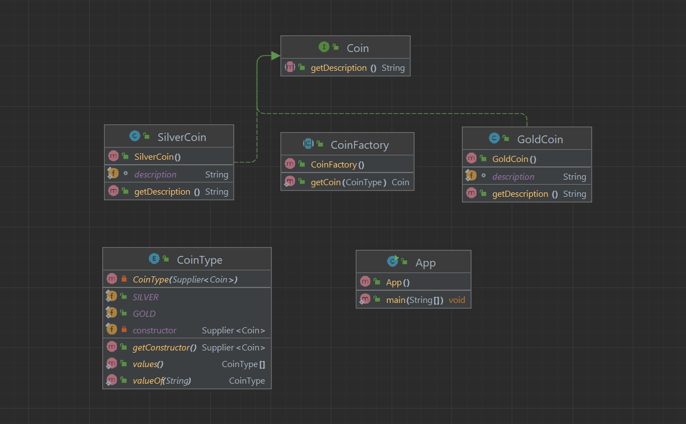

# Factory Pattern

The factory design pattern is used when we have a superclass with
multiple sub-classes and based on input, we need to return one of the 
sub-class. This pattern takes out the responsibility of the instantiation
of a class from the client program to the factory class. We can apply a 
Singleton pattern on the Factory class or make the factory method static. 
Check out Factory Design Pattern for example program and factory pattern 
benefits. This is one of the most widely used java design patterns.

### Class Diagram



## Step 1

create `Coin` interface

```Java
public interface Coin {
    String getDescription();
}
```

and create two implementations classes `SilverCoin` and `GoldCoin`

```java
public class SilverCoin implements Coin {

    static final String description = "This is Silver coin.";

    @Override
    public String getDescription() {
        return description;
    }
}

public class GoldCoin implements Coin {

    static final String description = "This is Gold coin.";

    @Override
    public String getDescription() {
        return description;
    }
}
```

## Step 2

returns an object instance of the type entered

```java
@RequiredArgsConstructor
@Getter
public enum CoinType {

    SILVER(SilverCoin::new),
    GOLD(GoldCoin::new);

    private final Supplier<Coin> constructor;
}
```

```java
public abstract class CoinFactory {

    public static Coin getCoin(CoinType type) {
        return type.getConstructor().get();
    }
}
```

## Step 3

```java
public class App {
    public static void main(String[] args) {
        Coin coinSilver = CoinFactory.getCoin(CoinType.SILVER);
        Coin coinGold = CoinFactory.getCoin(CoinType.GOLD);
        System.out.println("coinGold = " + coinGold.getDescription());
        System.out.println("coinSilver = " + coinSilver.getDescription());
    }
}
```

# Translate

Zavod dizayni namunasi bizda bir nechta kichik sinflarga ega bo'lgan
va kiritilgan ma'lumotlarga asoslanib, biz quyi sinflardan birini 
qaytarishimiz kerak bo'lgan superklassga ega bo'lganimizda ishlatiladi.
Ushbu naqsh mijoz dasturidan zavod sinfiga sinfni yaratish mas'uliyatini
o'z zimmasiga oladi. Biz zavod sinfida Singleton naqshini qo'llashimiz
yoki zavod usulini statik qilishimiz mumkin. Masalan, dastur va zavod
naqshining afzalliklari uchun Zavod dizayni namunasini tekshiring. 
Bu eng ko'p ishlatiladigan java dizayn naqshlaridan biridir.