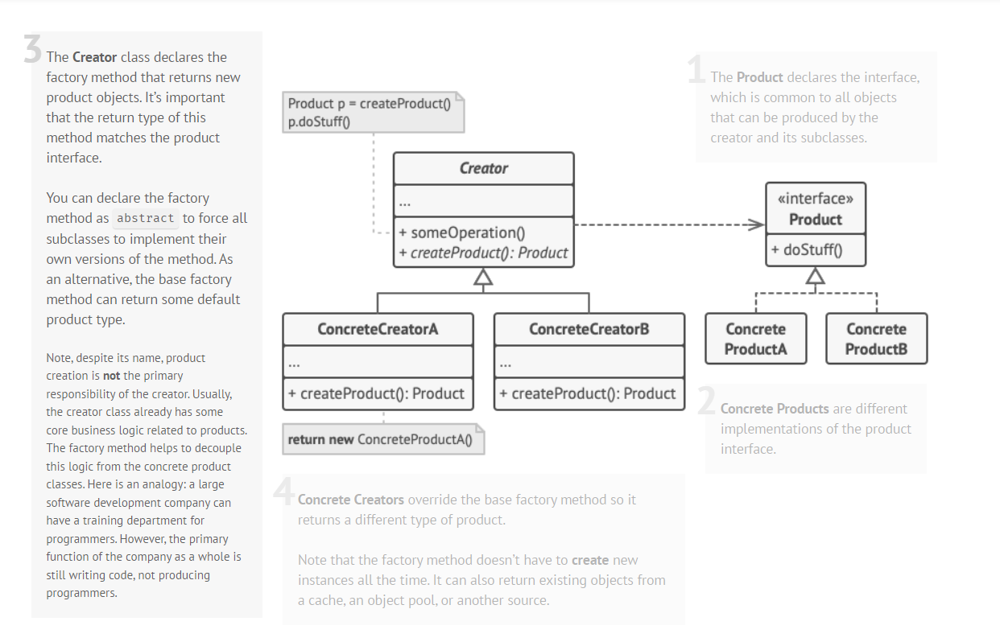
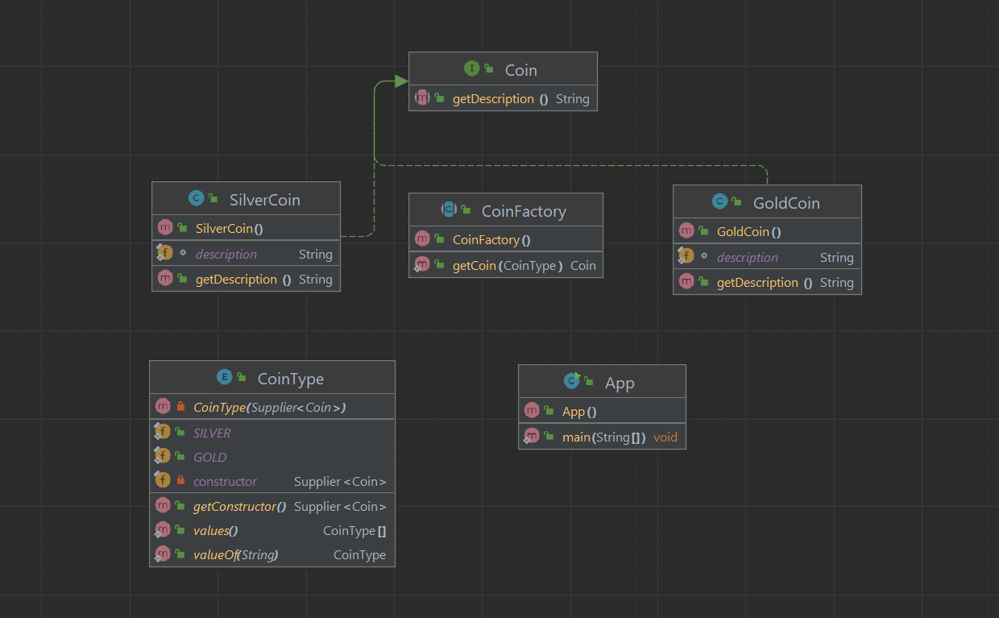

# Factory Method

## Overview

Factory Method - Creational Design Pattern bo'lib qisqacha qilib aytganda objectlarni yaratish uchun interface yoki
abstract classni ta'minlaydigan design pattern va uning subclassi qaysi classni yaratishni hal qiladi.
Bu Pattern objectlarni aniq classlarini ko'rsatmasdan yaratish muammosini hal qiladigan factory design pattern.

## Applicability

* Kodingiz ishlashi kerak bo'lgan ob'ektlarning aniq turlari va bog'liqliklarini oldindan bilmaganingizda Factory Method-dan foydalaning.

Factory Method Product yaratish kodini Productdan foydalanadigan koddan ajratib turadi. Shuning uchun Product qurilish kodini
kodning qolgan qismidan mustaqil rabishda kengaytirish osonroq.

Misol uchun, ilovaga yangi Product turini qo'shish uchun siz faqat yangi factory methodning pastki classini yaratishingiz
va undagi factory methodni bekor qilishingiz kerak bo'ladi.

## Example

Tushinish oson bo'lishi uchun uchun, faraz qilaylik mashina ishlab chiqaruvchi zavod bor biz unga mashina nomini beramiz
va u biz bergan mashina nomiga qarab bizga kerakli mashinani yetkazib beradi.

## Pattern Diagram



### Class Diagram



## Step 1

create `Coin` interface

```Java
public interface Coin {
    String getDescription();
}
```

and create two implementations classes `SilverCoin` and `GoldCoin`

```java
public class SilverCoin implements Coin {

    static final String description = "This is Silver coin.";

    @Override
    public String getDescription() {
        return description;
    }
}

public class GoldCoin implements Coin {

    static final String description = "This is Gold coin.";

    @Override
    public String getDescription() {
        return description;
    }
}
```

## Step 2

returns an object instance of the type entered

```java
@RequiredArgsConstructor
@Getter
public enum CoinType {

    SILVER(SilverCoin::new),
    GOLD(GoldCoin::new);

    private final Supplier<Coin> constructor;
}
```

```java
public abstract class CoinFactory {

    public static Coin getCoin(CoinType type) {
        return type.getConstructor().get();
    }
}
```

## Step 3

```java
public class App {
    public static void main(String[] args) {
        Coin coinSilver = CoinFactory.getCoin(CoinType.SILVER);
        Coin coinGold = CoinFactory.getCoin(CoinType.GOLD);
        System.out.println("coinGold = " + coinGold.getDescription());
        System.out.println("coinSilver = " + coinSilver.getDescription());
    }
}
```
