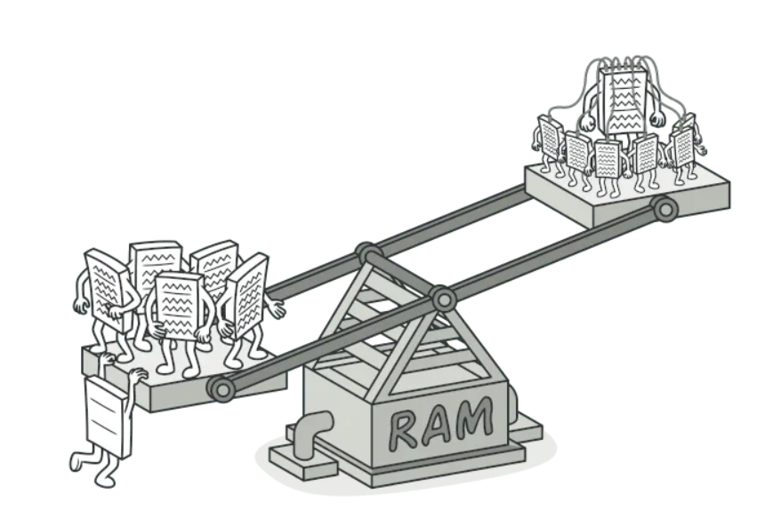

# Flyweight

Flyweight Design Pattern bir nechta objectlar o'rtasidagi umumiy ma'lumotlarni almashish orqali xotiradan foydalanishni
minimallashtirishga qaratilgan. Bu ayniqsa unumdorlikni oshirish va xotira maydonini kamaytirish uchun ko'p sonli 
o'xshash objectlar bilan ishlashda foydalidir. 

Flyweight Structural Design Patternga toifasiga kiradi. U bir nechta objectlar o'rtasida umumiy holatni almashish orqali
xotiradan foydalanishni optimallashtirishga qaratilgan. Ichki holat bir nechta objectlar orasida taqsimlanadi, tashqi
holat esa har xil bo'lishi mumkin. 

Flyweight Patterni asosiy tushunchasi intrinsic(ichki) va extrinsic(tashqi) holat o'rtasidagi farq. Ichki holat
Flyweightda saqlanadi. Tashqi holat Flyweight contextga bog'liq va o'zgarib turadi, shuning uchun uni share(baham)
ko'rish mumkin emas.

Flyweight Design pattern bitta maqsadi bor: xotira miqdorini minimallashtirish. Flyweight turli xil objectlar tomonidan
ishlatiladigan bir xil ma'lumotlarni cachelash orqali RAMni tejaydi.

## Example

- Java dagi Wrapper classlarni valueOf() static methodi har doim ham yani object yaratmaydi. Ushbu method cacheda
object mavjudligini tekshiradi. Agar u cacheda topilsa, u qaytariladi.

- JVM dagi String Pool - Flyweight patternga yana bir misoldir. intern() methodini chaqirganingizda, cachelangan 
objectni ham qaytarishi mumkin.
