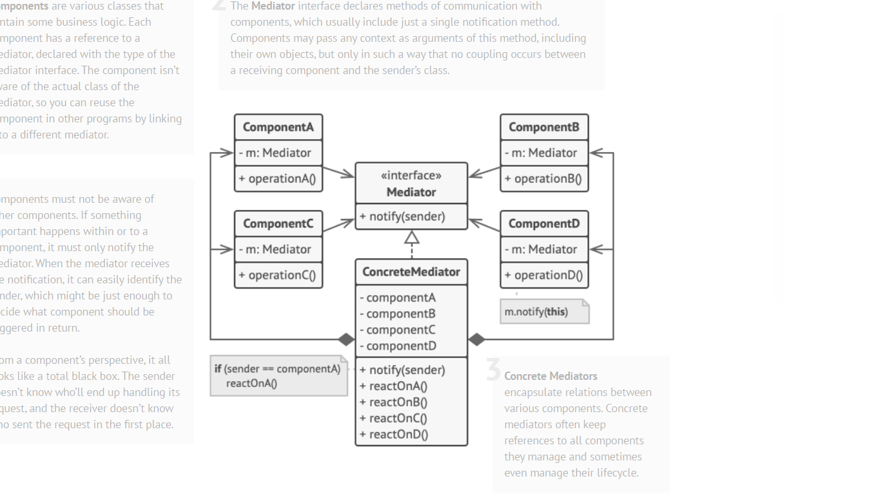

# Mediator

Mediator Design Pattern objectlar orasidagi aloqa Meditor objecti ichida encapsullatsiyalanadi. Objectlar endi bir biri
bilan bevosita aloqa qilmaydi, balki vositachi orqali muloqot qiladi. Bu aloqa qiluvchi objectlar orasidagi bog'liqliklarni
kamaytiradi va shu bilan ulanishni ham kamaytiradi.

Ushbu Design Pattern objectlar orasidagi to'g'ridan to'g'ri aloqalarni cheklaydi va ularni faqat vositachi object orqali
hamkorlik qilishga majbur qiladi.

Mediator Design Patternning maqsadi bir biri bilan bevosita bog'langan va bir-birga mahkam bog'langan objectlar
o'rtasidagi murakkablik va bog'liqlikni kamaytirishdir. Shunday qilib biz objectlar orasidagi bog'liqlikni kamaytirishimiz
va umumiy murakkablikni kamaytirishimiz mumkin.

Bundan tashqari, vositachi ob'ektidan foydalanib, biz aloqa mantig'ini yagona komponentga ajratamiz, shuning uchun biz 
Yagona javobgarlik tamoyiliga amal qilamiz. Bundan tashqari, tizimning qolgan qismlarini o'zgartirishga hojat 
qoldirmasdan yangi vositachilarni joriy qilishimiz mumkin. Demak, biz “Ochiq-yopiq” tamoyiliga amal qilamiz.

# Structure

