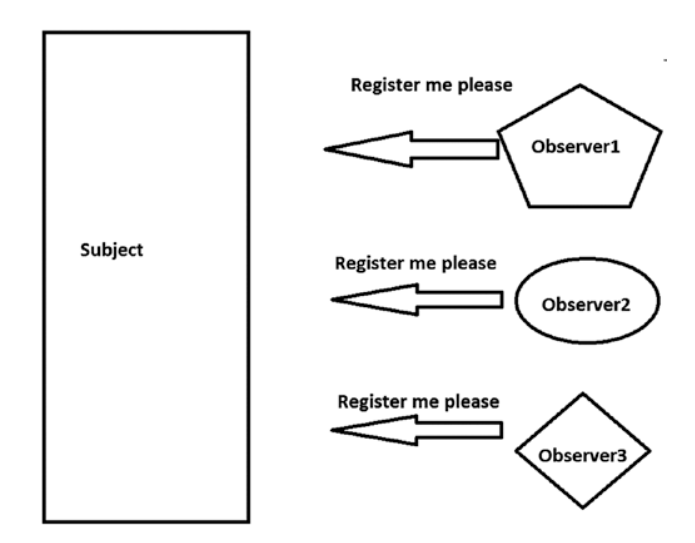
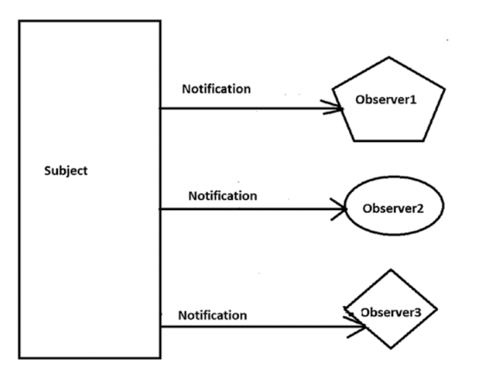

# Observer

Observer Patternni objejctlar orasida one-to-many bog'liqlikni belgilaydi, shunda bitta object holati o'zgartirganda,
uning barcha qaramlari avtomatik ravishda xabardor qilinadi va yangilanadi.

Ushbu Patternda ikki turdagi objectlar mavjud. Birinchisi kuzatuvchi yani observer, ikkinchisi esa bu subject.
Observer nima? bu boshqa objectda o'zgarish sodir bo'lganda xabardor qilinishi kerak bo'lgan object.
Kuzatuvchi yani observerlarga o'zgarish bo'lgan xabardor qiladigan object subject deb ataladi.

Odatda ko'plab kuzatuvchilar ma'lum bir mavzuni kuzatadilar. Kuzatuvchilar mavzudagi o'zgarishlarga qiziqqanlari uchun
mavzudan ro'yxatdan o'tishadi. Ba'zan bu model Publisher-Subscriber (PubSub) modeli deb ataladi. 

## 1. Step

## 2. Step

# Real Life Example

Ijtimoiy tarmoqlarda ko'plab foydalanuvchilari bo'lgan blogger misol qilib olaylik. Bloggerni subject dib olaylik,
uning foydalanuvchilari esa observer yani kuzatuvchilar. Blogger o'z blogiga qandaydur yani post qo'yganda uning 
kuzatuvchilariga yangi post joylangani haqida xabar boradi.
