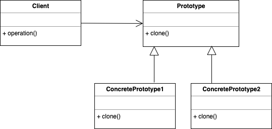

# Prototype 

Prototype allows us to hide the complexity of making new instances from the client. 
The concept is to copy an existing object rather than creating a new instance from scratch, 
something that may include costly operations. The existing object acts as a prototype and contains the state of the object. 
The newly copied object may change same properties only if required. This approach saves costly resources and time, especially 
when object creation is a heavy process.
The prototype pattern is a creational design pattern. Prototype patterns are required, when object creation is time consuming,
and costly operation, so we create objects with the existing object itself. One of the best available ways to create an object 
from existing objects is the clone() method. Clone is the simplest approach to implement a prototype pattern. However, 
it is your call to decide how to copy existing object based on your business model.

