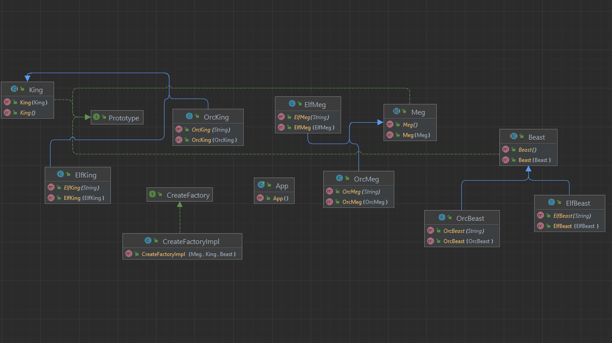

# Prototype 

Prototype allows us to hide the complexity of making new instances from the client. 
The concept is to copy an existing object rather than creating a new instance from scratch, 
something that may include costly operations. The existing object acts as a prototype and contains the state of the object. 
The newly copied object may change same properties only if required. This approach saves costly resources and time, especially 
when object creation is a heavy process.
The prototype pattern is a creational design pattern. Prototype patterns are required, when object creation is time consuming,
and costly operation, so we create objects with the existing object itself. One of the best available ways to create an object 
from existing objects is the clone() method. Clone is the simplest approach to implement a prototype pattern. However, 
it is your call to decide how to copy existing object based on your business model.

## Advantages of Prototype Design Pattern

- Adding and removing products at run-time – Prototypes let you incorporate a new concrete product class into a system simply by registering a prototypical instance with the client. That’s a bit more flexible than other creational patterns, because a client can install and remove prototypes at run-time.

- Specifying new objects by varying values – Highly dynamic systems let you define new behavior through object composition by specifying values for an object’s variables and not by defining new classes.

- Specifying new objects by varying structure – Many applications build objects from parts and subparts. For convenience, such applications often let you instantiate complex, user-defined structures to use a specific subcircuit again and again.

- Reduced subclassing – Factory Method often produces a hierarchy of Creator classes that parallels the product class hierarchy. The Prototype pattern lets you clone a prototype instead of asking a factory method to make a new object. Hence you don’t need a Creator class hierarchy at all.

## Translate

Prototype patterni noldan yangi namuna yaratish o'rniga mavjud object nusxalashdir. Bunday yondashuv resursni va vaqtni tejaydi.
Ayniqsa object yaratish qiyin ish bo'lganda.