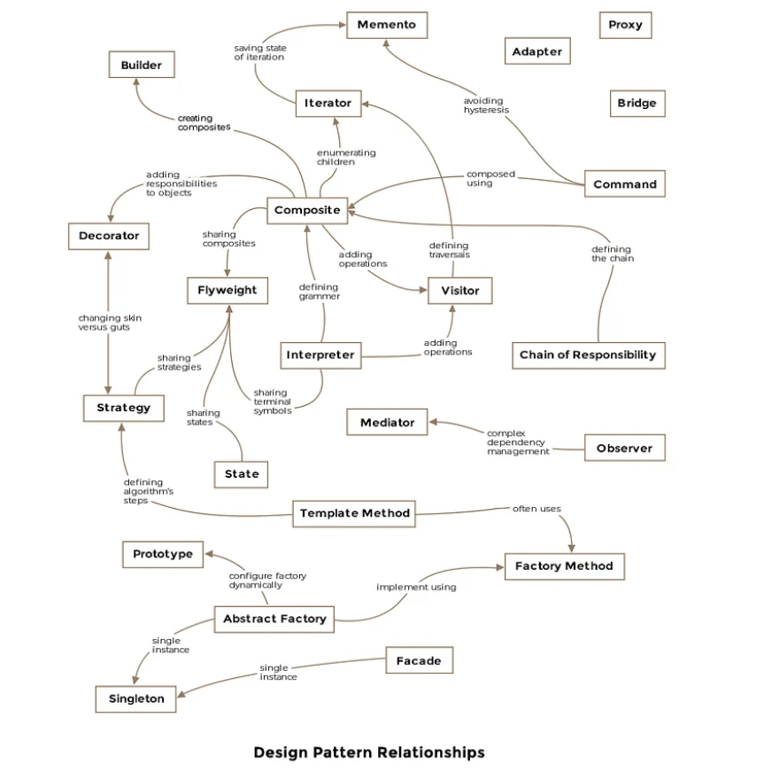

# Design patterns implemented in Java

# Intro

Design patterns are the best, formalized practices a programmer can use to solve common problems when designing an application or system.

Design patterns can speed up the development process by providing tested, proven development paradigms.

Reusing design patterns help prevent subtle issues that cause major problems, and it also improves code readability for coders and architects who are familiar with the patterns.

# Design Pattern Relationships

