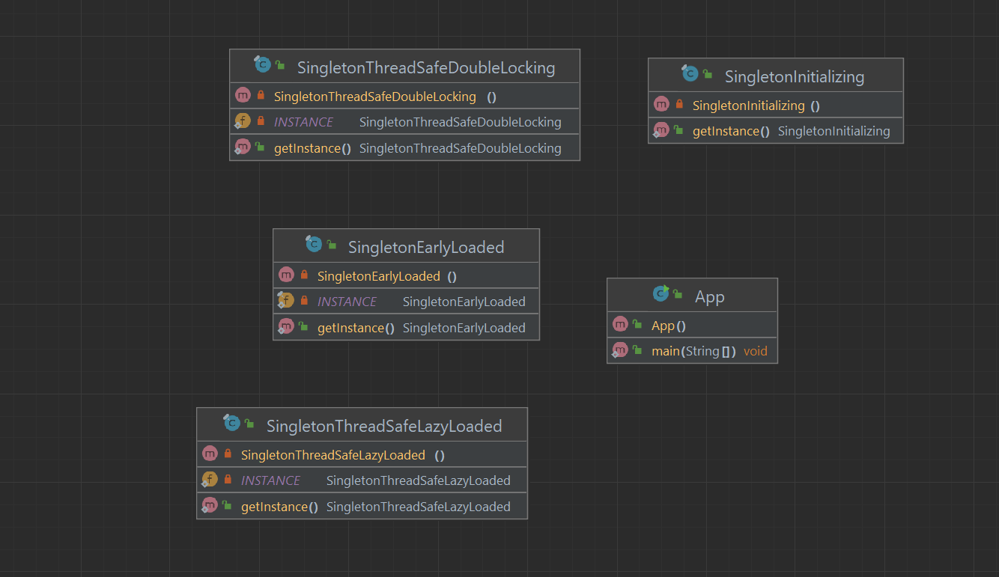

# Singleton Pattern

Singleton pattern restricts the instantiation of a class and ensures that only one instance of the class exists in the Java virtual machine. It seems to be a very simple design pattern but when it comes to implementation, it comes with a lot of implementation concerns. The implementation of the Singleton pattern has always been a controversial topic among developers. Check out Singleton Design Pattern to learn about different ways to implement Singleton pattern and pros and cons of each of the method. This is one of the most discussed java design patterns.

### Class Diagram

# Translate

Singleton namunasi sinfni yaratishni cheklaydi va Java virtual mashinasida sinfning faqat bitta nusxasi mavjudligini ta'minlaydi. Bu juda oddiy dizayn namunasi kabi ko'rinadi, lekin amalga oshirish haqida gap ketganda, u juda ko'p amalga oshirish tashvishlari bilan birga keladi. Singleton naqshini amalga oshirish har doim ishlab chiquvchilar orasida bahsli mavzu bo'lib kelgan. Singleton naqshini amalga oshirishning turli usullari va har bir usulning ijobiy va salbiy tomonlari haqida bilish uchun Singleton Design Pattern bilan tanishib chiqing. Bu eng ko'p muhokama qilinadigan java dizayn naqshlaridan biridir.