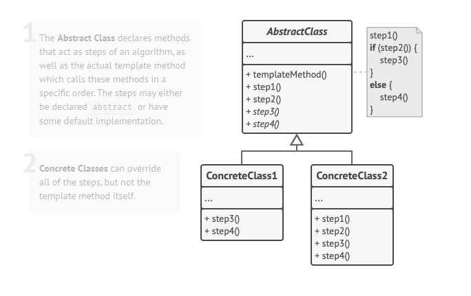

# Template Method

Template Method - bu supersinfdagi algoritm skeletini belgilaydigan, lekin quyi sinflarga uning tuzilishini oʻzgartirmasdan 
algoritmning muayyan bosqichlarini bekor qilishga imkon beruvchi xatti-harakat dizayn namunasidir.

# Structure

