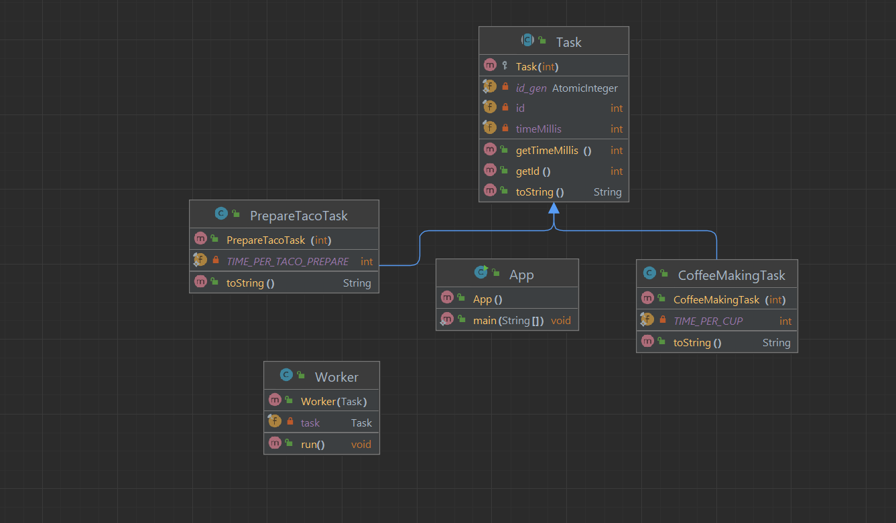

# Thread Pool

### Thread Pool is Concurrency Design Pattern

Thread Pool is a concurrency pattern where threads are allocated once and reused between tasks.

In computer programming, a thread pool is a software design pattern for achieving concurrency of execution in a computer
program. Often also called a replicated workers or worker-crew model, a thread pool maintains multiple threads waiting
for tasks to be allocated for concurrent execution by the supervising program. By maintaining a pool of threads, the
model increases performance and avoids latency in execution due to frequent creation and destruction of threads for
short-lived tasks. The number of available threads is tuned to the computing resources available to the program, such as
a parallel task queue after completion of execution.

### Diagram



It is often the case that tasks to be executed are short-lived and the number of tasks is large. Creating a new thread
for each task would make the system spend more time creating and destroying the threads than executing the actual tasks.
Thread Pool solves this problem by reusing existing threads and eliminating the latency of creating new threads.

## Programmatic Example

### Step 1

Create Task Classes

```java
public abstract class Task {

    private static final AtomicInteger id_gen = new AtomicInteger();

    private final int id;
    private final int timeMillis;

    protected Task(final int timeMillis) {
        this.id = id_gen.incrementAndGet();
        this.timeMillis = timeMillis;
    }

    public int getId() {
        return id;
    }

    public int getTimeMillis() {
        return timeMillis;
    }

    @Override
    public String toString() {
        return String.format("id=%d time=%d", id, timeMillis);
    }
}

public class CoffeeMakingTask extends Task {

    private static final int TIME_PER_CUP = 5;

    public CoffeeMakingTask(int countCups) {
        super(countCups * TIME_PER_CUP);
    }

    @Override
    public String toString() {
        return String.format("%s %s", this.getClass().getSimpleName(), super.toString());
    }
}

public class PrepareTacoTask extends Task {

    private static final int TIME_PER_TACO_PREPARE = 10;

    public PrepareTacoTask(int countTaco) {
        super(countTaco * TIME_PER_TACO_PREPARE);
    }

    @Override
    public String toString() {
        return String.format("%s %s", this.getClass().getSimpleName(), super.toString());
    }
}
```

### Step 2

```java
public class Worker implements Runnable {

    private final Task task;

    public Worker(Task task) {
        this.task = task;
    }


    @Override
    public void run() {
        System.out.println(String.format("%s processing %s", Thread.currentThread().getName(), task.toString()));
        try {
            Thread.sleep(task.getTimeMillis());
        } catch (InterruptedException e) {
            e.printStackTrace();
        }
    }
}
```

### Step 3

App.class
```java
  // Create a list of tasks to be executed
        List<Task> tasks = List.of(
                new PrepareTacoTask(5),
                new CoffeeMakingTask(3),
                new PrepareTacoTask(8),
                new CoffeeMakingTask(1),
                new PrepareTacoTask(4),
                new CoffeeMakingTask(5),
                new PrepareTacoTask(6),
                new CoffeeMakingTask(7),
                new PrepareTacoTask(4),
                new CoffeeMakingTask(2),
                new PrepareTacoTask(7),
                new CoffeeMakingTask(5)
        );

        // Creates a thread pool that reuses a fixed number of threads operating off a shared
        // unbounded queue. At any point, at most nThreads threads will be active processing
        // tasks. If additional tasks are submitted when all threads are active, they will wait
        // in the queue until a thread is available.
        ExecutorService executorService = Executors.newFixedThreadPool(3);

        // Allocate new worker for each task
        // The worker is executed when a thread becomes
        // available in the thread pool
        tasks.stream().map(Worker::new).forEach(executorService::execute);

        // All tasks were executed, now shutdown
        executorService.shutdown();
        while (!executorService.isTerminated()) {
            Thread.yield();
        }

        System.out.println("Program finished!");
```

# Translate

Kompyuter dasturlashda Thread Pool - bu kompyuter dasturida bajarilishning parallelligiga erishish uchun dasturiy
ta'minot design patterni. Ko'pincha takrorlangan ishchilar yoki ishchi-ekipaj modeli deb ham ataladi, thrad pool
nazorat qiluvchi dastur tomonidan bir vaqtning o'zida bajarilishi uchun vazifalar ajratilishini kutayotgan bir nechta
threadlarni saqlaydi. Threadlar to'plamini saqlab, model ishlashni oshiradi va qisqa muddatli vazifalar uchun
threadlarni tez-tez
yaratish va yo'q qilish tufayli bajarishda kechikishdan qochadi. Mavjud threadlar soni dastur uchun mavjud bo'lgan
hisoblash
resurslariga sozlanadi, masalan, bajarilish tugagandan so'ng parallel topshiriq navbati.

